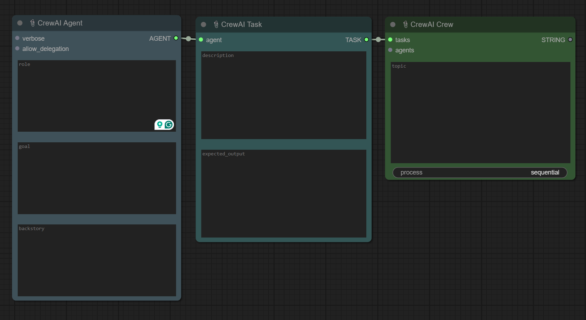
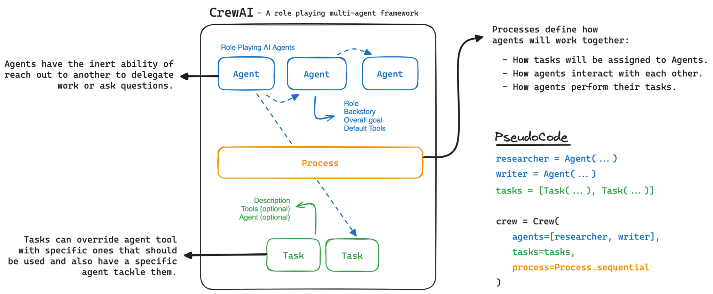

# 📎ComfyUI-CrewAI 



<hr/>

[](https://github.com/luandev/ComfyUI-CrewAI/actions/workflows/Flake8.yml)

This project integrates CrewAI's multi-agent collaboration framework into the ComfyUI environment, combining the robust capabilities of CrewAI's role-based AI agent system with ComfyUI's intuitive drag-and-drop interface. The goal is to create a platform that simplifies the management and execution of complex AI tasks.

<details>
<summary>
<b>ComfyUI? CrewAI?</b>
</summary>

## About ComfyUI

[ComfyUI](https://github.com/comfyanonymous/ComfyUI) is an innovative and user-friendly interface designed to streamline the creation and management of AI workflows. Utilizing a drag-and-drop system, ComfyUI allows users to effortlessly design, visualize, and deploy complex multi-agent tasks without deep technical knowledge. It supports a wide range of custom nodes and models, making it highly versatile for various AI applications.

## About CrewAI

[CrewAI](https://www.crewai.com/) is an advanced framework that facilitates the collaboration of AI agents. It enables agents to assume specific roles, share common objectives, and function as a cohesive unit. This setup is ideal for building smart assistant platforms, automated customer service systems, and multi-agent research teams.



### Key Features
- **Role-Based Agent Design:** Customize agents with specific roles, goals, and tools.
- **Autonomous Inter-Agent Delegation:** Agents can delegate tasks and request assistance from peers.
- **Flexible Task Management:** Define and dynamically assign tasks to agents.
- **Integration with Various LLMs:** Supports local and remote language models like OpenAI, Mistral, and others.
- **Sequential and Hierarchical Processes:** Offers structured task execution models.
</details>

## Integration with ComfyUI

Integrating CrewAI with ComfyUI provides a powerful, user-friendly interface for prototyping and deploying AI agent workflows. ComfyUI's drag-and-drop system makes it easy to design and visualize complex multi-agent tasks.

### Benefits of Integration
- **Streamlined Workflow Design:** Easily create and manage AI workflows.
- **Enhanced Collaboration:** Leverage CrewAI's collaborative AI capabilities.
- **Seamless Model Integration:** Support for various LLMs, including local models via Ollama.
- **Scalable and Flexible:** Ideal for prototyping and scaling AI solutions.

## How It Works

1. **Create Agents:** Define agents with specific roles and backstories.
2. **Define Tasks:** Set tasks with clear descriptions and expected outputs.
3. **Setup the Crew:** Use the Crew node to manage agents and tasks, choose the execution process (sequential or hierarchical).
4. **Run and Monitor:** Execute the workflow and monitor progress through verbose logging. Adjust settings and parameters to optimize performance.

## Installation 🛠️

**Easy Install (Coming Soon)**: Use the ComfyUI Manager to automate the installation process.

**Manual Install**:
1. Clone the repository into the custom_nodes directory:
    ```bash
    git clone https://github.com/luandev/ComfyUI-CrewAI.git
    ```
2. Install the requirements (ensure your virtual environment is activated if using one):
    ```bash
    pip install -r requirements.txt
    ```

## Linting and Code Quality
To maintain code quality, we use `flake8` for linting. We use pre-commit hooks to lint the staged files before committing:

1. **To run `pre-commit` manually**:
    ```bash
    pre-commit run --all-files 
    ```

2. **Run `flake8` manually**:
    ```bash
    flake8
    ```
## Current Nodes
- **Agent Node:** Defines an agent with a specific role and goal.
  - *Usage:* Customize the agent by setting attributes such as role, goal, backstory, and tools.
- **Task Node:** Specifies a task for an agent to perform.
  - *Usage:* Define the task description, expected output, and assign it to an agent.
- **Crew Node:** Manages a group of agents and tasks, coordinating their execution.
  - *Usage:* Set up the crew with defined agents and tasks, and choose the process type (sequential or hierarchical).

## Coming Soon
- **LLM Node:** Supports custom language models, including local models via Ollama.
- **Text Import Node**
- **Text Export Node**

## Contributing 🤝

Contributions are welcome! Please read the [contributing guidelines](CONTRIBUTING.md) first.

## License 📄

This project is licensed under the MIT License - see the [LICENSE](LICENSE) file for details.

## Acknowledgements

Special thanks to the developers of [ComfyUI](https://github.com/comfyanonymous/ComfyUI) and [CrewAI](https://github.com/CrewAI) for their amazing tools.

---

Feel free to suggest improvements or report issues [here](https://github.com/luandev/ComfyUI-CrewAI/issues).
